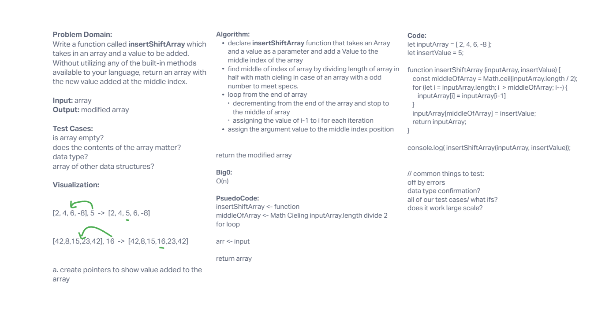

# Insert to Middle of an Array
<!-- Description of the challenge -->
Problem Domain:
Write a function called insertShiftArray which takes in an array and a value to be added. Without utilizing any of the built-in methods available to your language, return an array with the new value added at the middle index.
Input: array
Output: modified array

## Whiteboard Process
<!-- Embedded whiteboard image -->

## Approach & Efficiency
<!-- What approach did you take? Discuss Why. What is the Big O space/time for this approach? -->

Algorithm:
declare insertShiftArray function that takes an Array and a value as a parameter and add a Value to the middle index of the array
find middle of index of array by dividing length of array in half with math cieling in case of an array with a odd number to meet specs.
loop from the end of array
decrementing from the end of the array and stop to the middle of array
assigning the value of i-1 to i for each iteration
assign the argument value to the middle index position

return the modified array

Big0:
O(n)
bigger the array the longer run time.

PsuedoCode:
insertShiftArray <- function
middleOfArray <- Math Cieling inputArray.length divide 2
for loop

arr <- input

return array
