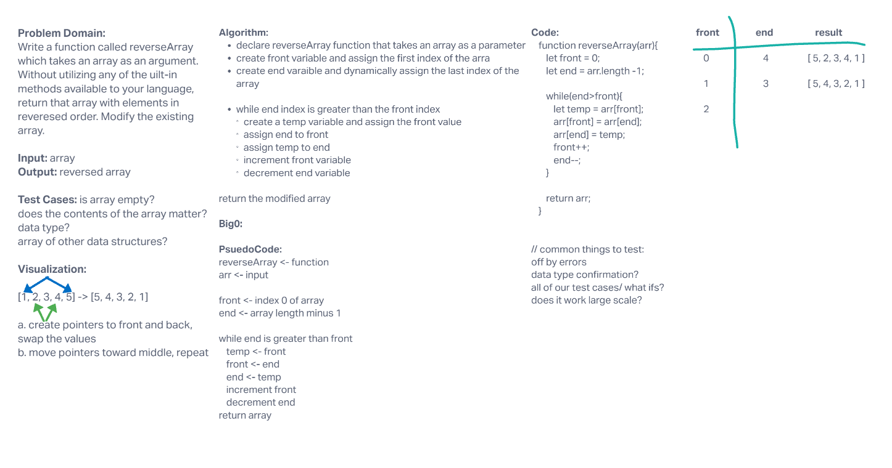

# Reverse an Array
<!-- Description of the challenge -->
Whiteboard reverseArray function

## Whiteboard Process
<!-- Embedded whiteboard image -->

## Approach & Efficiency
<!-- What approach did you take? Discuss Why. What is the Big O space/time for this approach? -->
Algorithm:

declare reverseArray function that takes an array as a parameter
create front variable and assign the first index of the arra
create end varaible and dynamically assign the last index of the array

while end index is greater than the front index
create a temp variable and assign the front value
assign end to front
assign temp to end
increment front variable
decrement end variable

return the modified array

Big0:

PsuedoCode:

reverseArray <- function

arr <- input

front <- index 0 of array

end <- array length minus 1

while end is greater than front
 temp <- front
 front <- end
 end <- temp
 increment front
 decrement end

return array
