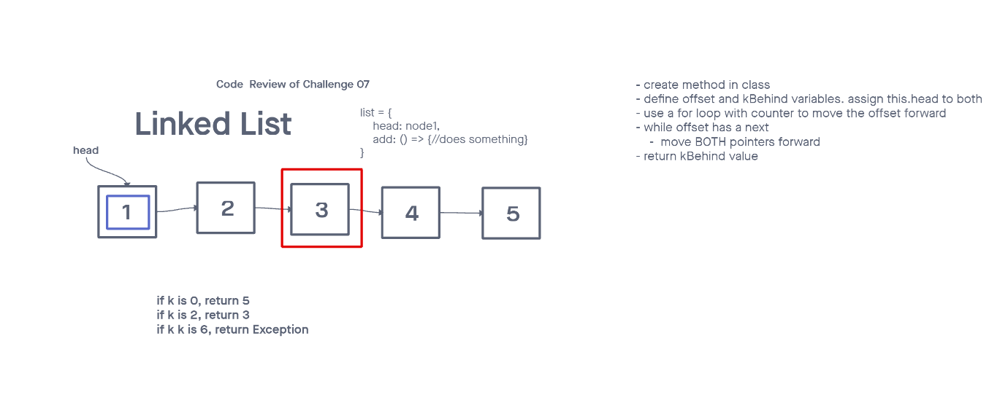
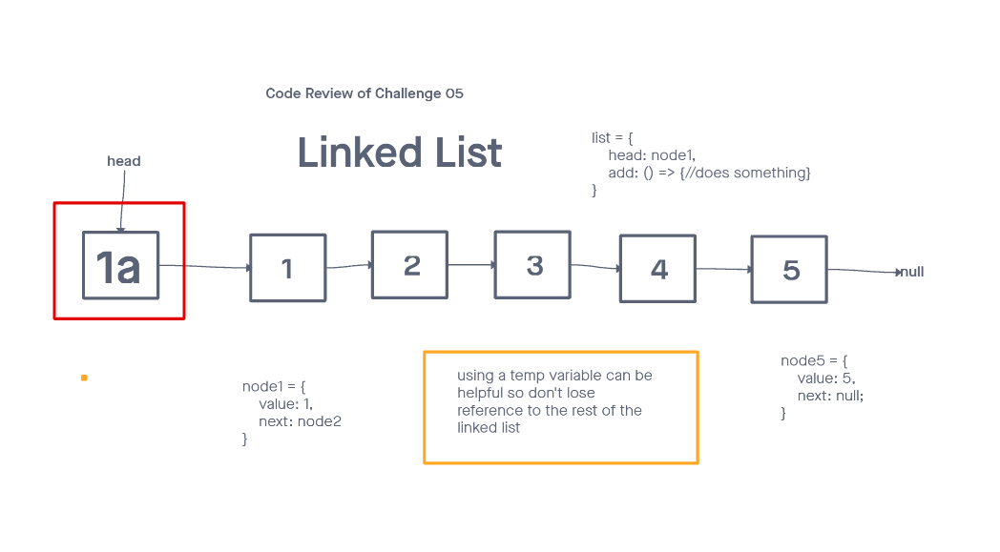

# Challenge Summary - linked-list-zip - Code Ch 8

## Whiteboard Process

Write a function called zip lists
Arguments: 2 linked lists
Return: New Linked List, zipped as noted below
Zip the two linked lists together into one so that the nodes alternate between the two lists and return a reference to the the zipped list.
Try and keep additional space down to O(1)
You have access to the Node class and all the properties on the Linked List class as well as the methods created in previous challenges.

## Approach & Efficiency

O(1);

## Solution
<!-- Show how to run your code, and examples of it in action -->

-----

# Challenge Summary - linked-list-kth - Code Ch 7

## Whiteboard Process

## Approach & Efficiency

O(1);

## Solution
<!-- Show how to run your code, and examples of it in action -->

-----

# Challenge Summary - linked-list-insertions - Code Ch 6

## Whiteboard Process

## Approach & Efficiency
  Wrote more methods to our LinkedList class, append, insertBefore, insertAfter. The approach was to successfully insert before and after and append to our linked list. 

  Node Class
  Linked List:
    append 
    insert before
    insert after

## Solution
<!-- Show how to run your code, and examples of it in action -->
Can successfully add a node to the end of the linked list
Can successfully add multiple nodes to the end of a linked list
Can successfully insert a node before a node located i the middle of a linked list
Can successfully insert a node before the first node of a linked list
Can successfully insert after a node in the middle of the linked list
Can successfully insert a node after the last node of the linked list
-----

# Challenge Summary - linked-list - Code Ch 5

## Whiteboard Process

## Approach & Efficiency
  Created a Node, and Linked List class. Added three methods to the linkedlist class insert, includes, and to string. Create a linkedlist and traverse through the linked list and run methods accordingly.

  Node Class
  Linked List:
    insert 
    includes
    toString

## Solution

Can successfully instantiate an empty linked list
Can properly insert into the linked list
The head property will properly point to the first node in the linked list
Can properly insert multiple nodes into the linked list
Will return true when finding a value within the linked list that exists
Will return false when searching for a value in the linked list that does not exist
Can properly return a collection of all the values that exist in the linked list