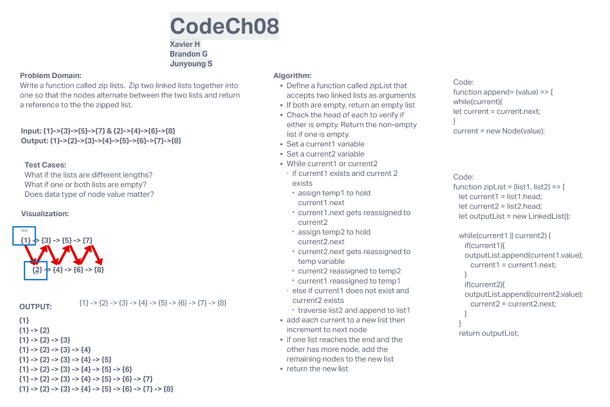
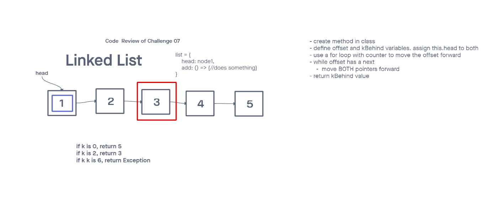
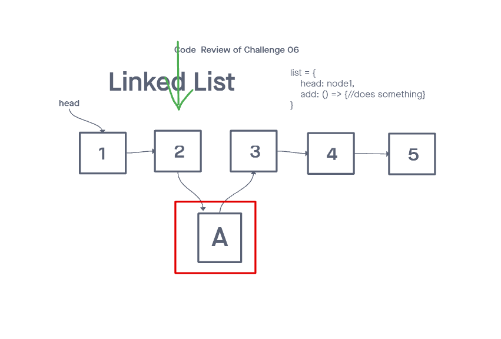
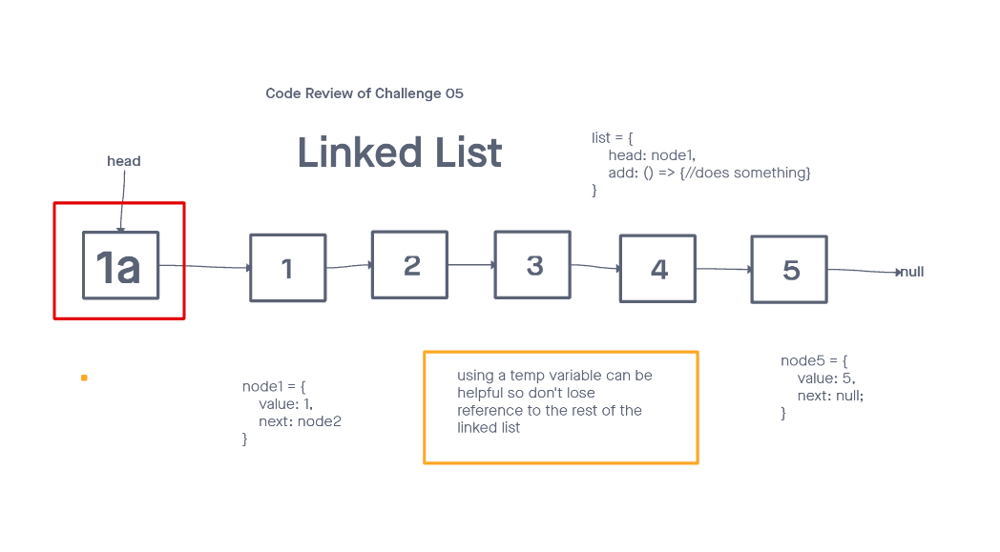

# Challenge Summary - linked-list-zip - Code Ch 8

## Whiteboard Process

Write a function called zip lists
Arguments: 2 linked lists
Return: New Linked List, zipped as noted below
Zip the two linked lists together into one so that the nodes alternate between the two lists and return a reference to the the zipped list.
Try and keep additional space down to O(1)
You have access to the Node class and all the properties on the Linked List class as well as the methods created in previous challenges.

## Approach & Efficiency

O(1);

## Solution
<!-- Show how to run your code, and examples of it in action -->
// Code Challenge 08
function zipList(list1, list2) {
  let current1 = list1.head;
  let current2 = list2.head;
  let outputList = new LinkedList();

while (current1 || current2) {
    if (current1) {
      outputList.append(current1.value);
      current1 = current1.next;
    }
    if (current2) {
      outputList.append(current2.value);
      current2 = current2.next;
    }
  }
  return outputList;
}
-----

# Challenge Summary - linked-list-kth - Code Ch 7

## Whiteboard Process

## Approach & Efficiency

O(1);

## Solution
<!-- Show how to run your code, and examples of it in action -->
kthFromEnd(k) {
    let offset = this.head;
    let nBehind = this.head;

    for (let i = 0; i < k; i++) {
      offset = offset.next;
    }

    while (offset.next) {
      offset = offset.next;
      nBehind = nBehind.next;
    }

    return nBehind.value;

}
}
-----

# Challenge Summary - linked-list-insertions - Code Ch 6

## Whiteboard Process

## Approach & Efficiency

## Solution
<!-- Show how to run your code, and examples of it in action -->
insertBefore(value, newValue) {
    this.length++;
    if (this.head.value === value) {
      this.head = new Node(newValue, this.head);
      return;
    }
  }
    let current = this.head;
    while (current.next.value !== value) {
      current = current.next;
    }
    current.next = new Node(newValue, current.next);
  }

insertAfter(value, newValue) {
    let current = this.head;
    while (current.next !== null && current.value !== value) {
      current = current.next;
    }
    current.next = new Node(newValue, current.next);
    this.length++;
  }
}
-----

# Challenge Summary - linked-list - Code Ch 5

## Whiteboard Process

## Approach & Efficiency

## Solution

insert(value){
    let node = new Node(value);
    node.next =this.head;
    this.head = node;
  }
includes(value) {
    let result = false;
    let current = this.head;
    while (current) {
      if (current.value === value) result = true;
      current = current.next;
    }
    return result;
  }
toString() {
    let str = '';
    let current = this.head;
    while (current) {
      str += `{ ${current.value} } ->`;
      current = current.next;
    }
    str += 'NULL';
    return str;
  }
}
