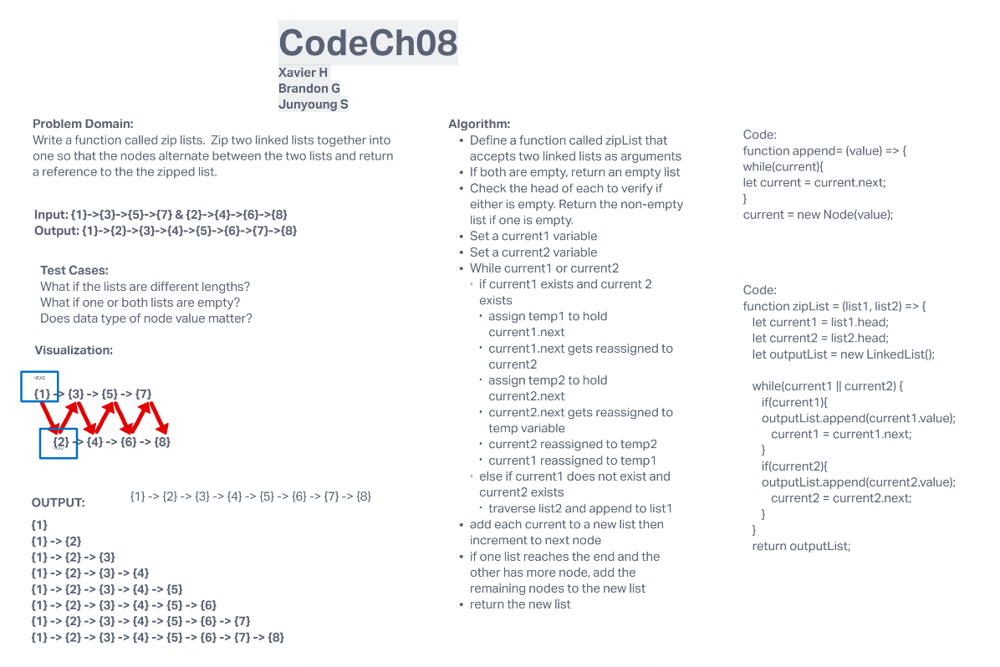

# Challenge Summary
Linked List

## Whiteboard Process

## Approach & Efficiency
O(1);

## Solution
<!-- Show how to run your code, and examples of it in action -->

-----

# Challenge Summary
Linked List

## Whiteboard Process

## Approach & Efficiency
O(1);

## Solution
<!-- Show how to run your code, and examples of it in action -->

-----

# Challenge Summary
Linked List

## Whiteboard Process

## Approach & Efficiency
O(1);

## Solution
<!-- Show how to run your code, and examples of it in action -->

-----

# Challenge Summary
Linked List - Code Ch 5

## Whiteboard Process

## Approach & Efficiency

## Solution
insert(value){
    let node = new Node(value);
    node.next =this.head;
    this.head = node;
  }
includes(value) {
    let result = false;
    let current = this.head;
    while (current) {
      if (current.value === value) result = true;
      current = current.next;
    }
    return result;
  }
toString() {
    let str = '';
    let current = this.head;
    while (current) {
      str += `{ ${current.value} } -> `;
      current = current.next;
    }
    str += 'NULL';
    return str;
  }

