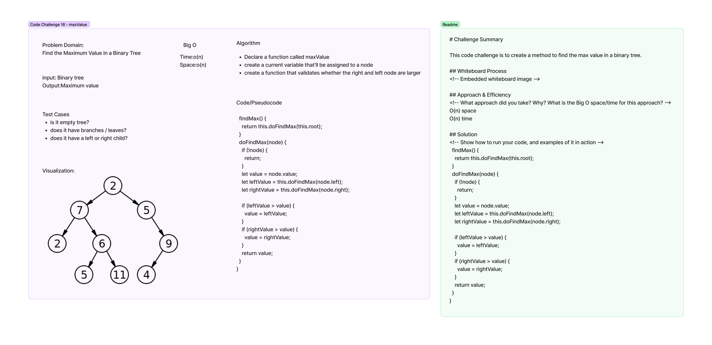

# Trees - MaxValue - Code Ch 16
This code challenge is to create a method to find the max value in a binary tree. 

## Whiteboard Process
<!-- Embedded whiteboard image -->

## Approach & Efficiency
<!-- What approach did you take? Why? What is the Big O space/time for this approach? -->
O(n) space
O(n) time

## Solution
<!-- Show how to run your code, and examples of it in action -->
  findMax() {
    return this.doFindMax(this.root);
  }
  doFindMax(node) {
    if (!node) {
      return;
    }
    let value = node.value;
    let leftValue = this.doFindMax(node.left);
    let rightValue = this.doFindMax(node.right);

    if (leftValue > value) {
      value = leftValue;
    }
    if (rightValue > value) {
      value = rightValue;
    }
    return value;
  }
}

# Trees - Code Ch 15
<!-- Short summary or background information -->
Understand the use of trees and how they function, using the preOrder, inOrder, and postOrder methods.

## Challenge
<!-- Description of the challenge -->
Create a BinaryTree & BinarySearchTree class and use preOrder, inOrder, postOrder, add, and contains methods to the respective classes. As well as breadth method. 

## Approach & Efficiency
<!-- What approach did you take? Why? What is the Big O space/time for this approach? -->
On time On space

## API
<!-- Description of each method publicly available in each of your trees -->
no API used. 